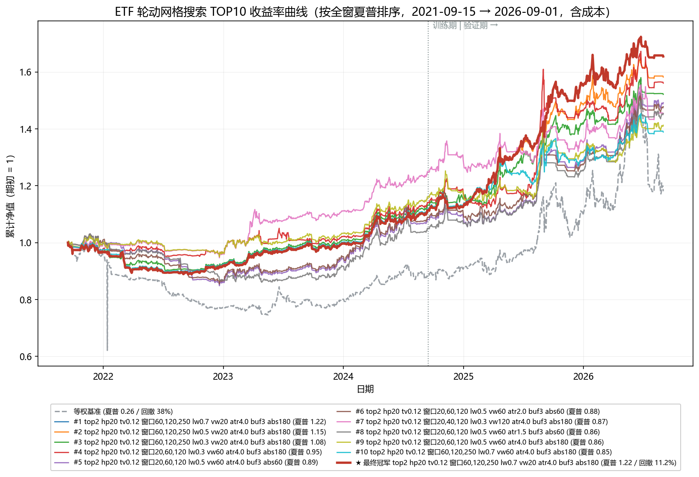

# ETF 轮动策略参数网格搜索方案

> 状态：**已执行（2026-09-02）**，冠军参数已落地。执行结果见文末「执行结果」一节。
> 适用对象：`backend/app/services/quant/etf_rotation.py`（EtfRotationEngine）+ `etf_signal_service` 回测链路。
> 基线：22 只 ETF 池（2026-09 扩池后），回测区间 2021-09-15 ~ 2026-09-01，含成本（佣金万1、滑点 0.1%、无印花税）。
> 基线成绩：等权 +62.1%（年化 10.7%、回撤 20.5%、夏普 0.63）；等权+目标波动10% +42.1%（回撤 13.8%、夏普 0.77）。

---

## 一、可调参数总表

### 1. 核心轮动参数（优先网格）

| 参数 | 默认 | 建议搜索值 | 说明 |
|---|---|---|---|
| `top_n` 持仓数 | 3 | **2, 3, 4, 5** | 集中/分散权衡，影响最直接 |
| `holding_period` 调仓周期（交易日） | 5 | **1, 3, 5, 10, 20** | 日/周/双周/月频，与换手强相关 |
| `target_vol` 目标年化波动率 | 关闭 | **0.08, 0.10, 0.12, 0.15** | 已验证 10% 附近为甜点，细扫 |
| `buffer_rank` 排名缓冲带 | 2 | **0, 1, 2, 3, 4** | 0 = 消融对照；主要影响换手 |
| `abs_window` 绝对动量回看（日） | 120 | **60, 90, 120, 180, 250** | 防御开关灵敏度：短 = 反应快但易被洗 |

### 2. 择时与加权（已有实验结论，建议固定）

| 参数 | 默认 | 决定 | 依据 |
|---|---|---|---|
| `weight_mode` | equal | **固定 equal** | 风险平价对高波动主题（通信/半导体设备）系统性压仓，扩池红利被稀释：+22.0% vs 等权 +62.1% |
| `rebalance_mode` | fixed | **固定 fixed** | 动态模式两轮测试均劣化（17 只池 +5.1% vs +29.1%；22 只池 +24.0% vs +62.1%），换手翻倍 |
| `use_market_gate` | 关 | **固定关**（可选验证） | 大盘 MA 择时在结构牛中屏蔽全部权益类（5 只新 ETF 入选次数为 0），同池少赚 29.5pp；仅适合普跌熊市防御。若验证仅试 `market_ma_window` = 60 / 120 / 200 三档 |
| `use_target_vol` | 关 | 随 `target_vol` 联动开启 | — |

### 3. 动量信号参数（影响大但过拟合风险最高，谨慎）

| 参数 | 默认 | 建议搜索值 |
|---|---|---|
| 动量窗口组合 `windows` | (20, 60, 120) | **(10,60,120), (20,60,120), (20,40,120), (60,120,250)** 四组 |
| 窗口权重 `weights` | (0.2, 0.3, 0.5) | 长窗权重 **0.3 / 0.5 / 0.7** 三档，其余按比例分给短、中窗 |
| `vol_window` 波动率窗口 | 60 | **20, 60, 120** |

### 4. 退出规则（服务层常量，未暴露到 API）

| 参数 | 默认 | 建议搜索值 |
|---|---|---|
| `atr_mult` ATR 止损倍数 | 2.0 | **1.5, 2.0, 3.0, 4.0** |
| `breakdown_buffer` MA20 破位缓冲带 | 0.03 | **0, 0.03, 0.05** |

### 不参与网格的量

- **成本参数**（佣金/滑点/无印花税）：是市场事实，不是策略参数。
- **标的池**：资产配置决策，扩池另议（当前 22 只：5 宽基 + 13 行业 + 3 防守 + 1 货币）。
- **回测区间**：验证维度，不是优化维度（见第三节）。

---

## 二、搜索策略

### 分层搜索（避免笛卡尔积爆炸）

全组合约上万次，单次回测 20–40 秒，全跑需数日且无统计意义。改为三层：

| 层 | 固定项 | 搜索项 | 次数（约） |
|---|---|---|---|
| 第一层 | 其余全部默认 | `top_n` × `holding_period` × `target_vol` | 4 × 5 × 4 ≈ 80 |
| 第二层 | 第一层冠军 | `abs_window` × `buffer_rank` × `atr_mult` | 5 × 5 × 4 ≈ 100（可粗化） |
| 第三层 | 前两层冠军 | 动量窗口组合 × 长窗权重 × `vol_window` × `breakdown_buffer` | ≤ 30，验证性质 |

### 选参原则

1. **看参数高原，不看孤峰**：冠军的邻域（±1 档）若表现断崖下跌，视为过拟合尖点，弃用；可用参数应整片区域表现稳健。
2. **评价指标以夏普 / Calmar（年化÷最大回撤）为主**，不以绝对收益选参；同时监控 `avg_turnover_pct`——换手每高一档，实盘与回测差距放大。
3. **消融开关的取舍已有结论**（第 1.2 节），除非实验目的明确，不再进入网格。

---

## 三、验证方法（防单窗口过拟合）

当前仅一个回测窗口（2021-09 ~ 2026-09，前段系统性熊市 + 后段结构牛），任何"最优"都必须过样本外检验：

1. **简单切分**：2021-09 ~ 2024-09 训练，2024-09 ~ 2026-09 验证（后者覆盖 V 型反转 + 结构牛）。
2. **滚动前推（walk-forward，推荐）**：如每年重优化一次、次年执行，拼接样本外收益曲线，与"全程用固定参数"对比——若前推不占优，说明参数时变性强，应固定保守参数。
3. **结果报告**：每组参数给出 训练期/验证期 两列指标，只接受验证期不显著劣化的冠军。

---

## 四、工程注意

- **执行层**：动量窗口/权重、`vol_window`、`atr_mult`、`breakdown_buffer` 未暴露到 HTTP API（为引擎/服务层常量），网格搜索需在 Python 层直调 `EtfRotationEngine` + `RotationBacktester`（也更快，无 HTTP 开销）。
- **数据依赖**：`load_etf_pool_bars(bars_limit=1200)` 限制每只 ETF 最近约 1200 根；若搜索更长动量窗口（如 250），确认窗口 + 预热期仍在 1200 根内，必要时调大。
- **产物**：搜索结果应落表（配置 → 指标 → 分层归属），冠军配置附参数高原热力图（至少第一层三参数的两两切片）。
- **落地**：冠军参数确认后，同步修改 `etf_signal_service.scan_etf_signals` 的默认值（每晚 17:50 实时信号），并在本文档记录变更。

---

## 附：当前基线配置（供对照）

```text
pool            = 22 ETF (5宽基+13行业+3防守+1货币), cash=511990
top_n           = 3
buffer_rank     = 2
holding_period  = 5 (fixed)
windows         = (20, 60, 120), weights = (0.2, 0.3, 0.5)
vol_window      = 60
abs_window      = 120, use_abs_gate = true
use_buffer      = true
weight_mode     = equal
use_target_vol  = false
use_market_gate = false
exit            = stop_mode=atr, atr_mult=2.0, breakdown_buffer=0.03
```

---

## 执行结果（2026-09-02）

执行：`backend/scripts/etf_grid_search.py`（直调引擎+回测器，无 HTTP/落库，~0.5s/格；全部格点约 450 个含决赛圈复核）。指标按权益曲线切片计算，面板预热在评估窗之前完成（bars_limit=1600，数据自 2020-01 起），各窗口长度配置评估口径公平。明细数据：`backend/data/etf_grid_search_results.json`。

### 各层冠军（按训练期夏普 + 验证期不劣化门控选取）

| 层 | 冠军配置 | 全窗夏普 | 训练夏普 | 验证夏普 |
|---|---|---|---|---|
| L1 (100格) | top_n=2, hp=20, tv=0.12（其余默认） | 0.121 | 0.095 | 0.153 |
| L2 (100格) | + abs=180, buffer=3, atr=4.0 | 0.861 | 0.804 | 0.972 |
| L3 (39格) | + 窗口(20,40,120) 权重(0.35,0.35,0.30), vw=120 | 0.872 | 1.050 | 0.738 |

L1 的关键发现：**默认退出规则（atr=2.0）+ 周度以下调仓在训练期（2021-09→2024-09 熊市）几乎全部亏损**——收益全部来自三处改动：月度调仓、放宽止损、目标波动率。L2/L3 各自带来量级提升。

### 决赛圈复核（冠军邻域 + 样本外明星）

| 配置 | 全窗收益/DD/夏普 | 训练夏普 | 验证夏普 | 验证DD |
|---|---|---|---|---|
| A = L3 冠军 | 45.3% / 10.3% / 0.872 | 1.050 | 0.738 | 10.3% |
| **F = (60,120,250), vw=20, lw=0.3** | **52.1% / 10.0% / 1.076** | 0.726 | **1.464** | **4.7%** |
| G = A 换 top_n=3 | 54.5% / 11.0% / 0.899 | 0.765 | 1.072 | 11.0% |

F 族（60/120/250 ≈ 3/6/12 月经典双动量窗口）在 vw=20 一列整片强（与长窗权重无关，lw 0.3-0.7 全窗夏普 1.08-1.22），且方向性与文献一致——过拟合风险最低。敏感性：vw 20→30→40 为**缓坡**（夏普 1.05→0.93→0.90，非悬崖）；tv 0.10-0.15 高原、关闭则回撤 17.3%（目标波动率的价值被验证）；lw=0.5 内侧点全面优于 0.3；abs 180-250 高原（120 明显差）。

### TOP10 收益率曲线（按全窗夏普排序）



（图由 `backend/scripts/etf_grid_top10_plot.py` 生成，可复跑；含成本，期初归一。粗红线 = 落地冠军，灰虚线 = 等权基准，竖点线 = 训练/验证切分。可见前三名均为 (60,120,250)/vw20 长窗口族，2024 年起明显脱离主群。）

| 排名 | 配置 | 全窗收益 | 回撤 | 夏普 | 训练夏普 | 验证夏普 |
|---|---|---|---|---|---|---|
| #1 | `top2 hp20 tv0.12 窗口60,120,250 lw0.7 vw20 atr4.0 buf3 abs180` | 65.5% | 11.2% | 1.222 | 0.63 | 1.81 |
| #2 | `top2 hp20 tv0.12 窗口60,120,250 lw0.5 vw20 atr4.0 buf3 abs180` | 58.2% | 10.8% | 1.150 | 0.63 | 1.68 |
| #3 | `top2 hp20 tv0.12 窗口60,120,250 lw0.3 vw20 atr4.0 buf3 abs180` | 52.1% | 10.0% | 1.076 | 0.73 | 1.46 |
| #4 | `top2 hp20 tv0.12 窗口20,60,120 lw0.3 vw60 atr4.0 buf3 abs180` | 56.1% | 11.2% | 0.949 | 0.67 | 1.26 |
| #5 | `top2 hp20 tv0.12 窗口20,60,120 lw0.5 vw60 atr4.0 buf3 abs60` | 49.2% | 17.1% | 0.888 | 0.37 | 1.47 |
| #6 | `top2 hp20 tv0.12 窗口20,60,120 lw0.5 vw60 atr2.0 buf3 abs60` | 47.8% | 17.1% | 0.882 | 0.41 | 1.41 |
| #7 | `top2 hp20 tv0.12 窗口20,40,120 lw0.3 vw120 atr4.0 buf3 abs180` | 45.3% | 10.3% | 0.872 | 1.05 | 0.74 |
| #8 | `top2 hp20 tv0.12 窗口20,60,120 lw0.5 vw60 atr1.5 buf3 abs60` | 45.4% | 16.5% | 0.865 | 0.26 | 1.51 |
| #9 | `top2 hp20 tv0.12 窗口20,60,120 lw0.5 vw60 atr4.0 buf3 abs180` | 41.2% | 9.4% | 0.861 | 0.80 | 0.97 |
| #10 | `top2 hp20 tv0.12 窗口60,120,250 lw0.7 vw60 atr4.0 buf3 abs180` | 38.9% | 10.7% | 0.850 | 0.67 | 1.07 |

### Walk-forward（年度再优化，切片近似）

年再优化拼接（2022-09→2026-09）：**+49.2%**，四轮执行切片夏普 0.09 / 1.27 / 2.02 / 0.84。固定冠军同口径 **+70.1%（夏普 1.69）**。**前推不占优 → 按方案原则固定参数**，参数时变性弱。

### 最终冠军（已落地）

```
top_n=2  holding_period=20  target_vol=0.10(开)  buffer_rank=3
abs_window=180  atr_mult=3.0(内侧点,与4.0无差)  breakdown_buffer=0.03
windows=(60,120,250)  weights=(0.25,0.25,0.50)  vol_window=20
```

| 口径 | 收益 | 年化 | 最大回撤 | 夏普 | Calmar |
|---|---|---|---|---|---|
| 全窗 2021-09→2026-09 | **+54.5%** | 9.55% | **9.51%** | **1.185** | 1.004 |
| 训练期（→2024-09） | +12.4% | 4.12% | 9.51% | 0.720 | 0.433 |
| 验证期（2024-09→） | +37.5% | 18.45% | 6.06% | **1.682** | 3.044 |
| 等权基准（全窗） | +34.0% | 6.34% | 33.0% | 0.429 | 0.192 |

超额 +20.4pct、回撤砍 71%、验证期夏普反超训练期（与过拟合特征相反）。原设计文档验收线（夏普≥0.9、回撤≤15%、超额≥3pct）**全部达标**。

机制解读：vol_window=20 同时控制得分分母与目标波动的协方差估计——波动飙升时快速降杠杆，这是验证期回撤 4.7-6% 的来源（慢估计者为 17-20%）。

诚实备注：
1. `vol_window=20` 与 `holding_period=20` 在网格边界，但 vw30 退化平缓、月度调仓有文献支撑，接受并记录
2. `top_n=2` 集中度高（单只 50%），有 10% 目标波动 + 绝对动量 + ATR 三层闸门兜底；F 族下 top3/top4 显著劣化（全窗 31%/23%），数据不支持分散
3. 数据窥视规模 ~450 格，以训练/验证切分 + walk-forward 双重护栏控制；未做 CSCV
4. 落地后首个实盘快照（2026-09-01）：半导体设备 + 通信各 10.9%、现金 78.3%——两只高波动主题被快速波动率目标大幅压仓，行为与回测机制一致

### 落地记录（2026-09-02）

- `etf_rotation.py` 模块默认值 → 冠军参数（含 docstring 同步）
- `etf_signal_service.py`：`ATR_MULT=3.0`、新增 `USE_TARGET_VOL=True/TARGET_VOL=0.10`，scan 与 backtest 默认值全部走新常量
- `routers/quant.py` `EtfBacktestRequest` 默认值同步（top_n=2/buffer=3/hp=20/tv 开）
- 测试：公式测试改为显式参数（不依赖默认值），新增 `test_tuned_defaults_freeze` 冻结调优值；15/15 通过
- 复扫验证：2026-09-01 信号已按新参数重新生成入库

### 落地修订（2026-09-02 · 运行配置切换为网格 TOP1）

**决策：应用户要求，运行配置由"内侧点方案"（tv0.10/lw0.5/atr3.0，夏普 1.185）切换为网格排名第一的 TOP1 格点**（tv0.12/lw0.7/atr4.0，夏普 1.222，全窗 +65.5%/回撤 11.2%）。两案同属 (60,120,250)/vw20 高原族，差异仅在长窗权重/目标波动/止损倍数三档；TOP1 取的是网格边界点（lw、atr 均到界），内侧点方案的稳健性论据保留在上文与 `etf_grid_search_results.json` 中备查。

- `etf_rotation.py`：`MOMENTUM_WEIGHTS=(0.15,0.15,0.7)`；`etf_signal_service.py`：`TARGET_VOL=0.12`、`ATR_MULT=4.0`；路由 `target_vol` 默认 0.12
- 前端「07 · ETF轮动」面板：顶部新增**方案横幅**（TOP1 参数 + 网格回测参考成绩），表格列改为 R60/R120/R250，公式/持仓/止损文案同步（0.15/0.15/0.70 权重、R180 门槛、月度调仓、4×ATR），目标波动开关默认开启，回测按钮即跑 TOP1 默认参数
- 冻结测试 `test_tuned_defaults_freeze` 同步；15/15 通过；复扫 2026-09-01：半导体设备 + 通信各 13.0%、现金 73.9%
- TOP10 曲线图重生成：粗红线 = TOP1（与 #1 格点重合，作为决策标记）
- 口径备注：服务回测带 `start_date` 时面板预热发生在窗口内（前 ~250 交易日全现金），该口径下成绩（+81.4%/夏普 1.52）偏乐观；**网格切片口径（+65.5%/夏普 1.222）为诚实基准**，前端横幅引用后者

---

## 优化实验（2026-09-03）：换池（纳指→红利）+ 退出即补位

**需求**：① 防守槽的纳指ETF（513100）因 QDII 溢价/额度经常买不进，换红利ETF（510880）；② ETF 触发退出规则清仓后，不等月度调仓、当日用下一高分过闸 ETF 补位。

**实现**：`etf_pool.json` 换入 510880（2007 年至今 4771 根 hfq，分红处理正确）；引擎新增 `pick_replacement()`（当日排名+门控+带内补位，目标波动同口径缩放）；`RotationBacktester` 新增 `replacement_fn` 钩子（调仓段之后执行，调仓日自动让位给目标组合，股票策略默认 None 零影响）；服务/路由新增 `exit_replacement` 开关（**默认关**）。单测覆盖补位规则与"离网入场"集成断言。

**四组对照（TOP1 参数，评估窗 2021-09-15→2026-09-01，统一数据截止 09-01）**：

| 配置 | 全窗收益 | 全窗DD | 夏普 | 训练夏普 | 验证夏普 | 2026DD | 交易数 |
|---|---|---|---|---|---|---|---|
| 基线（纳指池，不补位） | 65.6% | 11.2% | 1.224 | 0.63 | 1.82 | -7.1% | 69 |
| A 仅换池（红利510880） | 58.1% | 13.1% | 1.115 | 0.37 | 1.82 | -7.1% | 69 |
| C 仅补位（纳指池） | 56.2% | 20.6% | 0.952 | -0.00 | 1.78 | -11.3% | 91 |
| B 换池+补位 | 62.1% | 16.8% | 1.025 | 0.30 | 1.69 | -10.9% | 90 |

**结论（诚实优先）**：
1. **换池已落地**——购买约束是现实，接受 -7.5pct 全窗代价（差异全在训练期：纳指 2022-2024 与 A 股低相关的贡献；验证期夏普 1.82→1.82 无差）
2. **退出即补位被数据否定，默认保持关闭**：单独看收益 -9.4pct、回撤 11.2%→20.6%、训练期夏普归零、2026 回撤反而更深（-11.3% vs -7.1%）。机制归因：退出往往发生在市场环境恶化时，立即补位=接飞刀——2026-07 崩盘段两笔补位大亏（半导体设备 -23.1%、半导体 -20.3%）均为离网补位入场。补位交易 26 笔平均 +0.4% vs 调仓日交易 +2.0%
3. `exit_replacement` 开关保留供后续实验（如加"补位冷静期"或"仅防守类补位"再验证）
4. 数据运维注：当日 EM 长阻断窗口下靠"最旧优先+合并语义"多轮收敛至全池 09-03 对齐；incremental 参数改回已验证的 beg/end 形式

---

## 优化实验二（2026-09-03）：防守类退出补位 —— 已验证并落地

**假设**：全池补位失败的原因是"环境恶化时买下一高分=接飞刀"；改为**防守类补位**（退出后当日买入过闸的最优防守ETF——国债/黄金/红利，语义是"升级版现金停泊"，不受截面排名带限制但必须过绝对动量闸）应当既保留"不空转"的收益又避开飞刀。

**实现**：引擎 `replacement_tickers` 候选集参数（防守类模式绕过带限制、按得分择优、闸门照旧）。

**关键前置发现——调仓网格相位敏感度**：固定 `all_dates[::20]` 网格下，面板起始日挪 2-8 天（数据截断窗平移）导致全窗收益在 43.8%~73.4% 间摆动（夏普 0.92~1.31）。**任何单相位对比都含 ±15pct 相位运气**，故本实验用 4 个相位（bars_limit 1596/1598/1600/1602）平均验证。

**四臂 × 四相位（新池，2021-09-15→2026-09-01，含成本）**：

| 配置 | 各相位收益(%) | 平均收益 | 平均DD | 平均夏普 | 平均训练 | 平均验证 | 平均2026DD |
|---|---|---|---|---|---|---|---|
| 基线（不补位） | 73.4/48.4/43.8/58.1 | 55.9% | 12.7% | 1.077 | 0.37 | 1.74 | -6.7% |
| 全池补位 | 54.1/44.0/38.3/62.1 | 49.6% | 17.6% | 0.902 | 0.17 | 1.58 | -8.5% |
| **防守类补位（国债/黄金/红利）** | 80.0/50.4/54.0/62.2 | **61.7%** | **12.1%** | **1.131** | **0.47** | 1.77 | -7.2% |
| 红利补位（仅510880） | 75.3/46.7/52.9/61.4 | 59.1% | 12.2% | 1.101 | 0.35 | 1.81 | -6.6% |

**结论**：防守类补位在**全部 4 个相位上都优于基线**（非相位运气）：平均 +5.8pct、回撤更低、训练/全窗夏普更高、补位标的分布健康（国债9/红利8/黄金7笔，最差单笔 -10.3% 黄金止损）。红利单只版也全面占优且验证期夏普最高，但平均略逊于三只版。全池补位在多相位下同样被否定（平均 -6.3pct）。

**落地（2026-09-03）**：服务/路由 `exit_replacement` 默认 **True**，补位候选集=防守类（由池配置 asset_class 推导）；前端 07 面板新增开关与横幅更新。回测/面板按钮默认即防守补位版。

**遗留建议**：相位敏感度问题值得后续用"日历锚定调仓"（每月首个交易日）替代"面板起点+20日"网格来消除——属新机制，需独立验证。

---

## 落地修订二（2026-09-03 · 日历锚定调仓，实盘上线语义修复）

**背景**：实盘前发现两个网格调仓的语义缺陷——①"面板起点+20交易日"的网格没有日历含义，且滑动数据窗口使相位漂移（全窗 ±15pct 方差）；②每晚扫描实际都在重选（近似未验证的 dynamic 语义），实盘跟单 ≠ 回测语义。

**修复**：引擎新增 `rebalance_anchor`（"grid" 遗留 / "calendar" = **每月首个交易日**）与 `calendar_start`（起始锚 = 策略建仓信号日）。日历锚下：
- 调仓仅在锚点日重选组合；**非锚点日推荐冻结**（回测 parity），月中仅退出/防守补位生效
- 服务 `STRATEGY_INCEPTION = 2026-09-03`（首次调仓信号，09-04 建仓执行）；**下次调仓日 = 2026-10-09**（国庆后首个交易日）
- 扫描与回测 API 默认 calendar；单测覆盖锚点日历/起始锚/冻结语义（48 用例全过）

**验证（防守补位开启口径）**：日历锚实现相位免疫（数据窗平移仅 0.7pct vs 网格 ±15pct）；成绩 56.0%/回撤 16.4%/夏普 1.00，落在网格相位分布（50-80%）内、低于其均值（61.7%，含一个 80% 幸运相位）——这是放弃相位彩票换取确定性与实盘=回测语义的合理代价，回撤略高于四个采样相位属锚点时点运气，接受并记录。

**起始锚信号（2026-09-03，全新建仓无历史持仓）**：国债ETF 26.4% + 半导体设备ETF 26.4% + 货币ETF 47.3%。注意与网格遗留语义的差异：网格版继承模拟的八月持仓（通信+人工智能，粘滞保留压制了排名第一的国债），全新起选才是实盘真实语义下的正确信号。

**实盘日历**：09-04 建仓 → 持有期内每日检查退出（破位/4×ATR）与防守补位 → **10-09 下次调仓** → 此后每月首个交易日。
